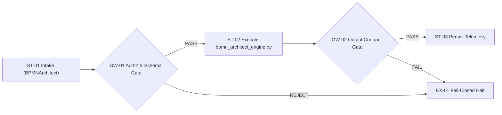

# BPMN 2.0 Workflow — BPMNArchitect

```mermaid
flowchart LR
    ST01["ST-01 Intake (BPMNArchitect)"] --> GW01{"GW-01 AuthZ & Schema Gate"}
    GW01 -->|PASS| ST02["ST-02 Execute bpmn_architect_engine.py"]
    GW01 -->|REJECT| EX01["EX-01 Fail-Closed Halt"]
    ST02 --> GW02{"GW-02 Output Contract Gate"}
    GW02 -->|PASS| ST03["ST-03 Persist Telemetry"]
    GW02 -->|FAIL| EX01
```
