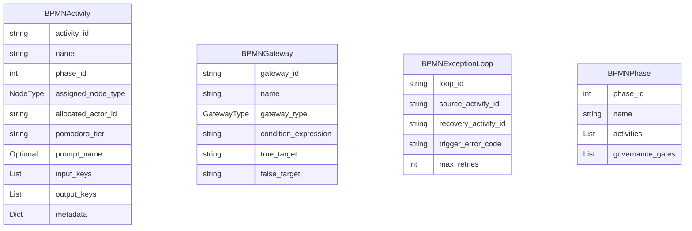

# Entity-Relationship Diagram

> Auto-generated by UCBDDManager ERDGenerator.
> Source hash: 9621e1b1c3c4baac5fa1b69aa062883556de88f8d130e1406d4a61330572b205

```mermaid
erDiagram
    BPMNActivity {
        string activity_id
        string name
        int phase_id
        NodeType assigned_node_type
        string allocated_actor_id
        string pomodoro_tier
        Optional prompt_name
        List input_keys
        List output_keys
        Dict metadata
    }
    BPMNGateway {
        string gateway_id
        string name
        GatewayType gateway_type
        string condition_expression
        string true_target
        string false_target
    }
    BPMNExceptionLoop {
        string loop_id
        string source_activity_id
        string recovery_activity_id
        string trigger_error_code
        int max_retries
    }
    BPMNPhase {
        int phase_id
        string name
        List activities
        List governance_gates
    }
```