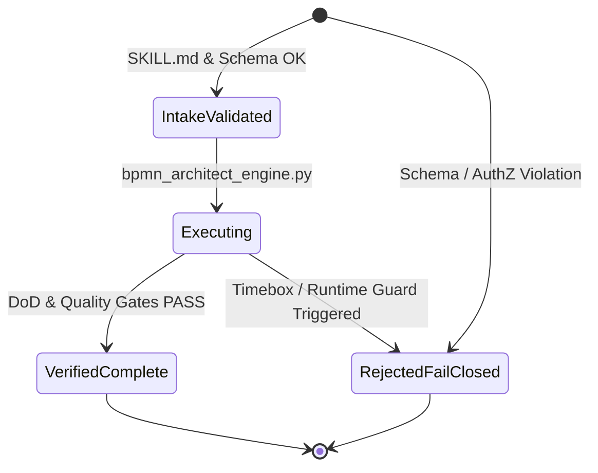

# Document & Execution State Machine — BPMNArchitect

```mermaid
stateDiagram-v2
    [*] --> IntakeValidated: SKILL.md & Schema OK
    [*] --> RejectedFailClosed: Schema / AuthZ Violation
    IntakeValidated --> Executing: bpmn_architect_engine.py
    Executing --> VerifiedComplete: DoD & Quality Gates PASS
    Executing --> RejectedFailClosed: Timebox / Runtime Guard Triggered
    VerifiedComplete --> [*]
    RejectedFailClosed --> [*]
```
