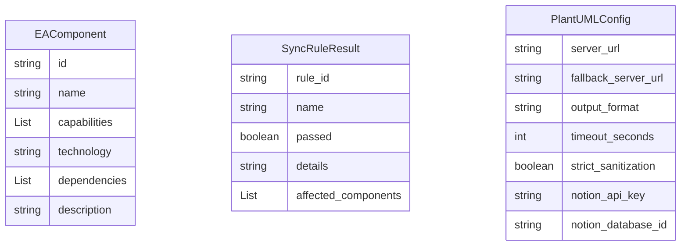

# Entity-Relationship Diagram

> Auto-generated by UCBDDManager ERDGenerator.
> Source hash: b6c6e0e8ffbe6731dee666dc4d6c624fb57f7ac307c5ec39cba9425042d9a821

```mermaid
erDiagram
    EAComponent {
        string id
        string name
        List capabilities
        string technology
        List dependencies
        string description
    }
    SyncRuleResult {
        string rule_id
        string name
        boolean passed
        string details
        List affected_components
    }
    PlantUMLConfig {
        string server_url
        string fallback_server_url
        string output_format
        int timeout_seconds
        boolean strict_sanitization
        string notion_api_key
        string notion_database_id
    }
```