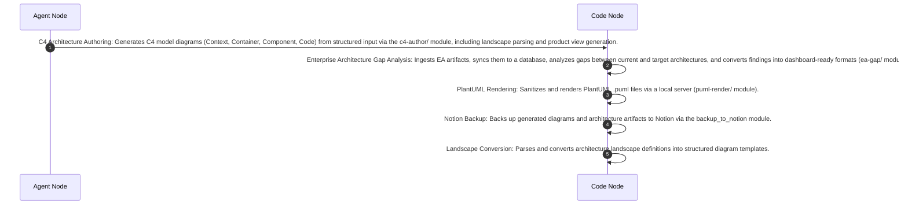

# Sequence Diagrams

> Auto-generated by UCBDDManager SequenceGenerator.
> Source hash: 16062dac1dd7799f547528b2545bf5c3aa9b97f58cb2042dc65cf7f26bf43af8

### UC-001: Capabilities

```mermaid
sequenceDiagram
    autonumber
    participant AgentNode as Agent Node
    participant CodeNode as Code Node
    AgentNode->>CodeNode: C4 Architecture Authoring: Generates C4 model diagrams (Context, Container, Component, Code) from structured input via the c4-author/ module, including landscape parsing and product view generation.
    CodeNode->>CodeNode: Enterprise Architecture Gap Analysis: Ingests EA artifacts, syncs them to a database, analyzes gaps between current and target architectures, and converts findings into dashboard-ready formats (ea-gap/ module).
    CodeNode->>CodeNode: PlantUML Rendering: Sanitizes and renders PlantUML .puml files via a local server (puml-render/ module).
    CodeNode->>CodeNode: Notion Backup: Backs up generated diagrams and architecture artifacts to Notion via the backup_to_notion module.
    CodeNode->>CodeNode: Landscape Conversion: Parses and converts architecture landscape definitions into structured diagram templates.
```
